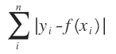
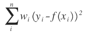
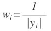
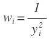

# Curve Fit Reference
Curve Fits are a key feature for Yob.  They are setup to work well "right out of the box," but they are also highly customizable.  This guide is meant to serve as a reference for using Curve Fits.  If you are new using Curve Fits, you may want to check out one of the following tutorials first:

* [Getting Started - Finding Project Distance](../tutorials/getting_started.md#finding-the-projected-distance)
* [Advanced Curve Fits](../tutorials/advanced_curve_fits.md)

---
## General Rules
* At a minimum, Curve Fits need to know which **Data Set** to use, and what type of **Model** to fit to the data.
* Curve Fits need sufficient data to work properly.  In general, complex models need more data than simple models.

---
## Built-in Models
Curve Fits come with the following built-in models:

<table>
    <thead><tr><th>Model Name</th><th>Expression</th></tr></thead>
    <tbody>
        <tr><td>Constant</td><td>cf(x) = C</td></tr>
        <tr><td>Proportional</td><td>cf(x) = A*x</td></tr>
        <tr><td>Linear</td><td>cf(x) = A*x + B</td></tr>
        <tr><td>Quadratic</td><td>cf(x) = A*x^2 + B*x + C</td></tr>
        <tr><td>Cubic</td><td>cf(x) = A*x^3 + B*x^2 + C*x + D</td></tr>
        <tr><td>Quartic</td><td>cf(x) = A*x^4 + B*x^3 + C*x^2 + D*x + F</td></tr>
        <tr><td>Quintic</td><td>cf(x) = A*x^5 + B*x^4 + C*x^3 + D*x^2 + F*x + G</td></tr>
        <tr><td>Power</td><td>cf(x) = A*x^B</td></tr>
        <tr><td>Inverse</td><td>cf(x) = A / x</td></tr>
        <tr><td>Inverse Square</td><td>cf(x) = A / (x^2)</td></tr>
        <tr><td>Sinusoid</td><td>cf(x) = A*sin(B*x + C) + D</td></tr>
        <tr><td>Exponential</td><td>cf(x) = A*B^x</td></tr>
        <tr><td>Natural Exponential</td><td>cf(x) = A*e^(B*x)</td></tr>
        <tr><td>Logarithmic</td><td>cf(x) = A + B*log(x)</td></tr>
        <tr><td>Natural Logarithmic</td><td>cf(x) = A + B*ln(x)</td></tr>
        <tr><td>Gaussian</td><td>cf(x) = A*e^(-(x-B)^2 / C^2) + D</td></tr>
        <tr><td>Normalized Gaussian</td><td>cf(x) = (1 / (S*sqrt(2*π))) * e^(-(x-M)^2 / (2*S^2))</td></tr>
        <tr><td>Logistic</td><td>cf(x) = A / (1 + e^(-B*x + C))</td></tr>
    </tbody>
</table>

### Custom Models
Curve Fits also support user-defined models.  Note that all the rules of Yob expressions apply.  See the [Expression Reference](./expression_reference.md) for more details.

---
## Regression Methods
Curve fits attempt to find the best model parameters by minimizing the sum of the differences between the outputs and predicted outputs (residuals) in some form or another.

Yob supports several different methods of solving this problem, but by far the most common (and default) is the Ordinary Least Squares (OLS) algorithm.  More details for each method are described below.

### OLS - Ordinary Least Squares
The **Ordinary Least Squares** algorithm is the most robust and general purpose algorithm, making it suitable for almost any data.  It finds the best model parameters by minimizing the sum of the _squared_ residuals.  In mathematical terms, it tries to minimize .  Since the residuals are squared, points that are further away from the curve are more harshly penalized than points that are close.

### LAD - Least Absolute Deviations
The **Least Absolute Deviations** algorithm attempts to minimize the sum of the absolute residuals, as opposed to the squared residuals like OLS.  In mathematical terms, it tries to minimize .  Since the residuals are not squared, this algorithm can handle outliers marginally better than OLS, **however**, unlike OLS, there are some cases where multiple solutions exist which can cause [instability](https://en.wikipedia.org/wiki/Least_absolute_deviations#Other_properties).

### WLS_1Y - Weighted Least Squares, 1 / Y
Both OLS and LAD assume that error is distributed evenly throughout the data, which is not always the case.  Take a look at the following data for example:

You can see that the error gets larger as Y gets larger.  The **Weighted Least Squares** algorithm is a variation on OLS that addresses this problem by weighting each residual so that it pays extra attention to data points that have small Y values, and pays less attention to points with large Y values, since it is assumed that they have greater amounts of error.  In mathematical terms, the algorithm tries to minimize .  For this particular version of WLS, .  The use cases of this algorithm are more limited than OLS, but recoginzing when it's appropriate to apply it can make a big difference in your experiment.  This is demonstrated graphically in the next variation of WLS below.

### WLS_1Y2 - Weighted Least Squares, 1 / Y2
This variation on WLS functions just like the previous one, the only difference being that .  The graph below shows the differences between a line fitted with OLS and a line fitted with WLS, using the data from the previous example:

---
## Guess Parameters
The curve fitting algorithms in Yob work by iteratively improving model parameters.  In layman's terms, Yob needs a ballpark estimate of what you think the best values for the model parameters should be so that it knows where to look for them.

### Manual vs Automatic
...

!!! info "Note"
    For all of the built-in models, you shouldn't have to worry about picking guess parameters since Yob automatically picks good guesses for them.  However, since picking guess parameters requires extra knowlege about the behavior of the model, Yob cannot automatically pick guess parameters for **custom models**.

---
## Parameter Output
...
