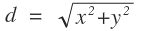

# Advanced Data Sets
In this tutorial, we will demonstrate how to take full advantage of Data Sets to maximize efficiency in a more complicated experiment.  For this experiment, we will be plotting the 2D coordinates of a ball rolling down a bumpy hill and generating other data from the coordinate information.

If you haven’t done so already, you may want to check out the [Getting Started tutorial](./getting_started.md) before you continue.

---
## The Data
<table>
	<tr>
		<th>Time (s)</th>
		<td>0.0</td>
		<td>0.5</td>
		<td>1.0</td>
		<td>1.5</td>
		<td>2.0</td>
		<td>2.5</td>
		<td>3.0</td>
		<td>3.5</td>
		<td>4.0</td>
		<td>4.5</td>
		<td>5.0</td>
		<td>5.5</td>
		<td>6.0</td>
</tr>
	<tr>
		<th>X (m)</th>
		<td>0.00</td>
		<td>0.03</td>
		<td>0.10</td>
		<td>0.22</td>
		<td>0.40</td>
		<td>0.62</td>
		<td>0.90</td>
		<td>1.22</td>
		<td>1.60</td>
		<td>2.02</td>
		<td>2.50</td>
		<td>3.02</td>
		<td>3.60</td>
</tr>
	<tr>
		<th>Y (m)</th>
		<td>0.00</td>
		<td>0.47</td>
		<td>0.84</td>
		<td>0.99</td>
		<td>0.90</td>
		<td>0.59</td>
		<td>0.14</td>
		<td>-0.35</td>
		<td>-0.75</td>
		<td>-0.97</td>
		<td>-0.95</td>
		<td>-0.70</td>
		<td>-0.27</td>
</tr>
</table>

Above, we have collected the X and Y coordinates of a ball as it rolls down a bumpy surface over time.  Let’s start with making a Data Set to plot how **X** changes with **Time**.  To do this, create a new Data Set, then simply copy the Time and X rows and paste them into their respective columns in the table editor. 

!!! info "Note"
    Yob will automatically detect when you have copied a row and will rotate your data to fill the column you're trying to paste to.
    

After you paste the data, you can throw on some labels like so:

---
## Sharing Columns
Now suppose that we want to overlay a second Data Set comparing **Y** with Time.  You may be thinking that we just need to create a new Data Set and copy over the Y and Time data, and you wouldn't be wrong, but there are a few issues with that approach.  Allow us to show you a slightly different way, and then we'll explain why it's beneficial.

First, create a new Data Set and copy just the **Y** values into the second column.  We're going to leave the first column empty for now.  Label the columns similarly to the first Data Set like so:

Next, click the calculator icon in the top right of the first column.  You will be presented with the following dialog:

Every column can be configured to calculate its values from the values of other columns.  (See the [Calculated Column Reference](../references/calculated_column_reference.md) for more details.)  In this case, we want the column to simply mirror the values from Time column of the first Data Set.

To do this, select **Data Set 1 - Time (d1c1)** from the dropdown menu and click **Insert**.  Every column has a [reference name](../references/expression_reference.md#referencing-other-items), so when you see `d2c1 = d1c1`, that means that the values from column 1 of Data Set 2 should equal the values from column 1 of Data Set 1.  You can use the dropdown menu to find the name of the column you're looking for.

Check the **Enabled** check box to make the calculations take effect.  Now all of the Time values should have automatically filled the column:

!!! warning "Note"
    Calculated columns cannot be edited since they are generated from other columns.  They are turned yellow to remind you of this:

### Benefits
You may be wondering why we took this round-about way of getting the time values into a second column.  What's wrong with copying and pasting?

Well, in this experiment it wouldn't have been so bad to simply copy and paste, but imagine an experiement where you were plotting **ten different dependent variables** against the same independent variable.  Not only would you have to copy and paste the same data ten times, but if you ever discovered a mistake, you would have to correct it in **ten different places**.

When you are using Calculated Columns, changes to the source column will propagate out to all the columns that depend on it, saving you time and errors.

---
## Generating Columns
If all has gone well thus far, your graph should look something like this:

Now suppose that we want to overlay a third Data Set showing the total distance between the ball and the origin.  We can calculate the values easily using the Euclidean distance forumla, , but crunching all of the numbers by hand is tedious.  This would be another great place to make use of Calculated Columns.

Let's start by making another Data Set and using the same technique we used above to copy the Time data into the first column:  First, create a new Data Set, then click the calculator icon in the top right of the first column.  Select **Data Set 1 - Time (d1c1)** from the dropdown menu, click **Insert**, then check the **Enabled** check box:

Before we continue, let's put some labels on this Data Set like so:

Now let's go ahead and fill our distance column.  If we were doing this by hand, we'd have to manually put each value from the X and Y columns through the  formula to get the values for distance.  With Calculated Columns, we can simply plug in this formula, and all the values will be calculated automatically:

Click on the calculator icon in the top right of the distance column, and enter `sqrt((d1c2)^2 + (d2c2)^2)` into the expression field.  This expression is saying that we want each value of the column to be the square root of the cooresponding **X** value (Data Set 1, Column 2) squared, and the cooresponding **Y** value (Data Set2, Column 2) squared.

!!! info "Tip"
    If you are struggling to get column names right, you can always use the drop down menu to locate and insert the names that you looking for.
    

    
Lastly, check the **Enabled** check box.  If you have done everything correctly, your graph should look like the following:

---
## Learn More
If you would like to learn more about Calculated Columns and expressions, check out these references:

* [Calculated Column Reference](../references/calculated_column_reference.md)
* [Expression Reference](../references/expression_reference.md)